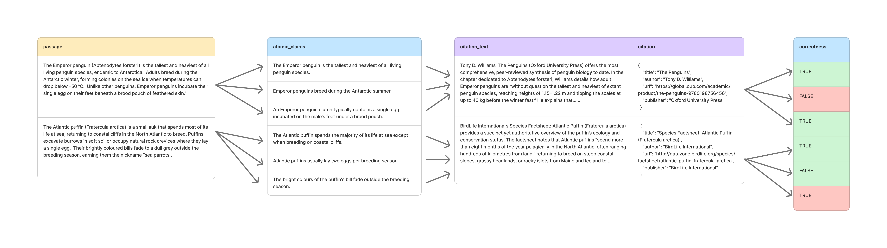

Creating an open source fact-checker for RAG chatbots. Research project by the Columbia AI Alignment Club.

## Goals
We are training our own fact-checking model to make it possible to implement well-researched frameworks (specifically, VeriScore and FactScore) at scale, complementing or even replacing the evaluation of RAG outputs against arbitrary ground truths and the use of subjective LLM as a Judge metrics. Particularly, we want to:
1. Make fact-checking feasible and accessible as an objective metric for evaluating RAG performance.
2. Make specialized fact-checkers a low-cost and accessible component of RAG workflows to boost generation reliability.

## Overall workflow

Main stages of the final fact-checker: 
1. Break down a generated response into atomic factual statement to assess (see: [FactScore](https://arxiv.org/abs/2305.14251))
2. Decide which factual claims are worthy of verification (see: [VeriScore](https://arxiv.org/html/2406.19276v1), a newer version of the FactScore framework)
3. [Situational] For larger retrieved contexts, break down the retrieved citation text into chunks and rank according to relevance for each fact.
4. Evaluate each fact against the retrieved context or relevant chunks, outputting a decision label signifying whether the citation supports the claim: True / False (or a popular alternative: "Supports", "Refutes", and "Irrelevant").
5. In practice, the result is passed over either to an LLM loop that will regenerate the response (in case of factual errors) or an evaluation score.

## Source datasets
Data will be collected and transformed from the following sources, potentially among other:
|                                       Dataset                                    |     Size    |           Details                           |          Labels            |
| :-----------------------------------------------------------------------------: | :----------: | :-------------------------: | :------------------------: |
|  [WAFER](https://github.com/facebookresearch/side/blob/main/datasets/WAFER.md)  | 3.8 million  |  Auto-generated passages + evidence text    | N/A: Only supported facts   |
|  [VitaminC](https://github.com/TalSchuster/VitaminC)                           |     450K      |    100K Wikipedia revisions and 300K+ synthetic examples   |    SUPPORTS, REFUTES, NOT ENOUGH INFO  |  
|  [FEVEROUS (2021)](https://fever.ai/dataset/feverous.html)                      |     87K      |  Manually verified claim + evidence pairs (Wikipedia)     | SUPPORTS, REFUTES, NOT ENOUGH INFO     |  
|  [AVeriTeC (2024)](https://fever.ai/dataset/averitec.html)                     |     4.5k     |      Subset of FEVER: Real-world examples (Wikipedia)      |     SUPPORTS, REFUTES, NOT ENOUGH INFO     | 
|  [Symmetric, FM2](https://github.com/google-research/fool-me-twice)            |     13K      |    Subset of FEVER: Rea-world examples (Wikipedia, expert verified, original)  |    N/A  |  
|   Citation Hunt                                                                 |     32K      |    Facts edited by adversarial methods  |   Symmetric, FM2   |    N/A: Only supported facts  |   

## Dataset collection format

[Examples of the desired final format of the dataset](https://docs.google.com/spreadsheets/d/10Dg2ox2oGiAoHKWaFDzwj_JAPou9FBGvbhlXQOjt1xQ/edit?usp=sharing). 

## Dataset creation 
1. Reformat datasets (Wikipedia, WAFER, FEVER, others if needed) into the desired format above.
2. Create a proportional amount of negative training examples, if missing from the data, by matching random erroneous citations with passages.
3. Add noisy data to simulate real world retrieval by creating a subset where multiple wrong contexts are appended to the correct citation context.  

## Training strategy
1. Use an open-source base model to enable sharing the fine-tuned fact-checker publicly as part of the research results.
2. Prioritize light-weight and smaller models, if feasible, since the goal of the research is to make fact-checking accessible and affordable.
3. Experiment with various models: incluyding discriminative and generative models, since this is essentially a classification problem. 
4. Short-list the best models by checking performance on zero and few-shot fact-checking before any fine-tuning.
5. Possible model to experiment with: Llama-3-8B, Qwen2.5-7B, BERT.
