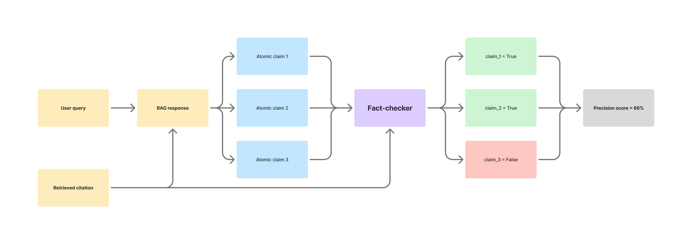

Creating an open source fact-checker for RAG chatbots. Research project by the Columbia AI Alignment Club.

## Overall fact-checking workflow

## Dataset collection

[Examples of the desired final format of the dataset](https://docs.google.com/spreadsheets/d/10Dg2ox2oGiAoHKWaFDzwj_JAPou9FBGvbhlXQOjt1xQ/edit?usp=sharing). Data will be collected and transformed from the following sources:
* WAFER
* KILT
* Citation Hunt
